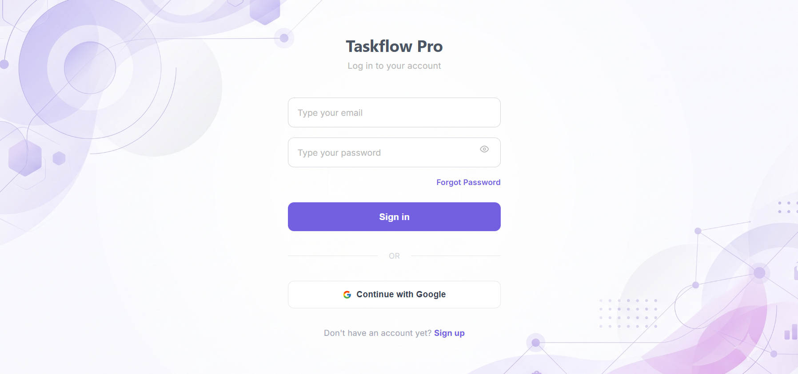
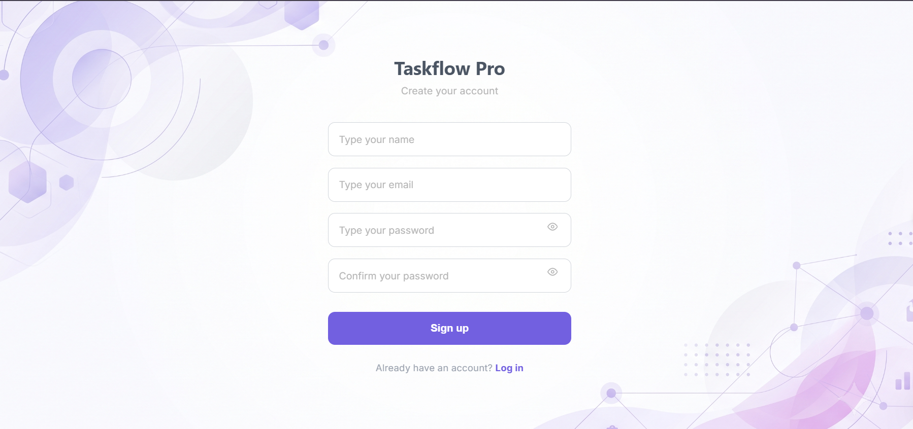
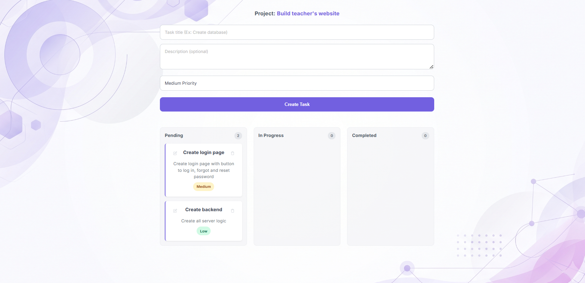

# Modern Task & Project Manager (Kanban Board)

A full-stack project management and task tracking application built with a modern UI, featuring a responsive Kanban board, drag-and-drop support, priority sorting, and mobile-first carousel navigation.

---

## Features

- **Secure Authentication:** JWT-based user authentication and protected routes.
- **Interactive Kanban Board:** Manage tasks across columns (*Pending*, *In Progress*, *Completed*) with smooth drag-and-drop functionality.
- **Priority Sorting:** Tasks are automatically organized by priority (*High*, *Medium*, *Low*).
- **Mobile-First Responsive Design:** Optimized for mobile devices with a native-like card swipe/carousel experience and snap scrolling.
- **Full CRUD Operations:** Create, read, update, and delete projects and tasks seamlessly.

---

## Tech Stack

### **Frontend:**
- React & TypeScript
- React Router DOM
- Axios
- Modern CSS (Flexbox & CSS Grid)

### **Backend:**
- Node.js & Express.js
- MongoDB & Mongoose (Secure user-scoped queries)
- JWT (JSON Web Tokens) for security
- bcrypt for password hashing

---

## Screenshots

---

## License

This project is open-source and available under the MIT License.