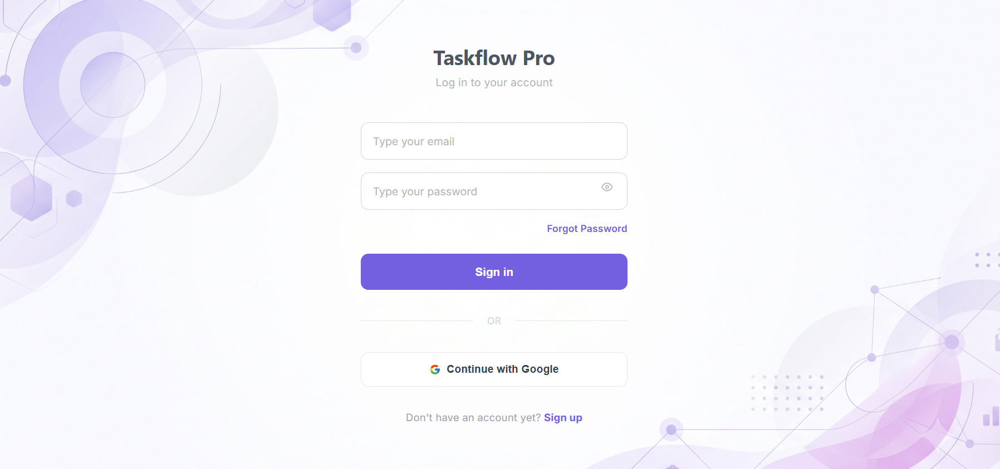
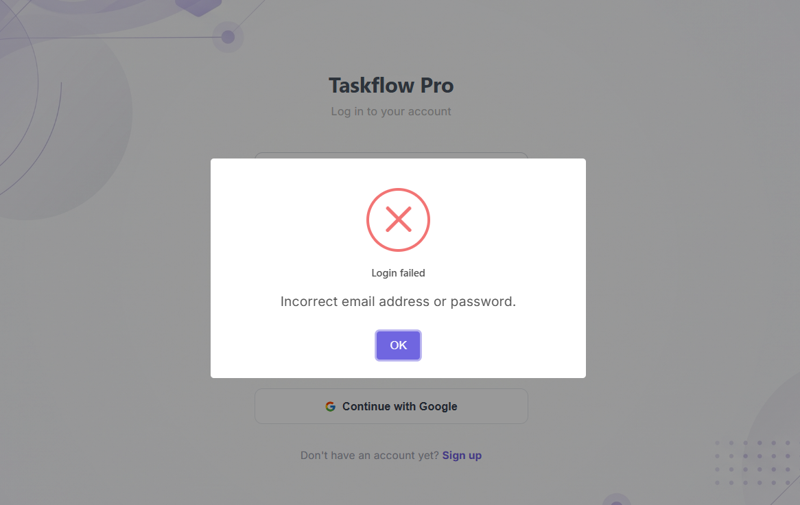
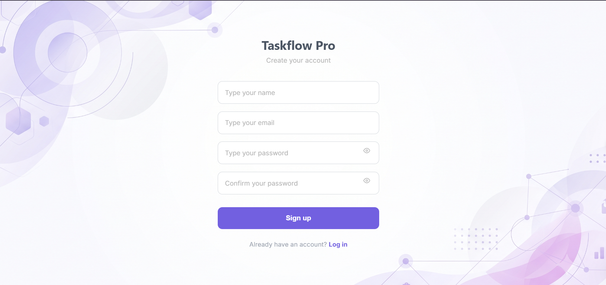
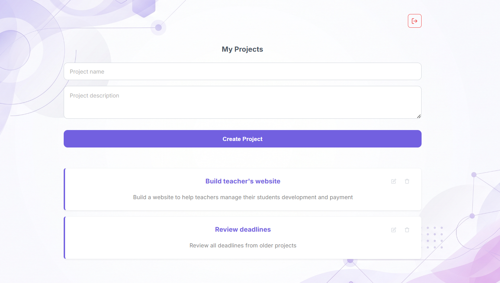
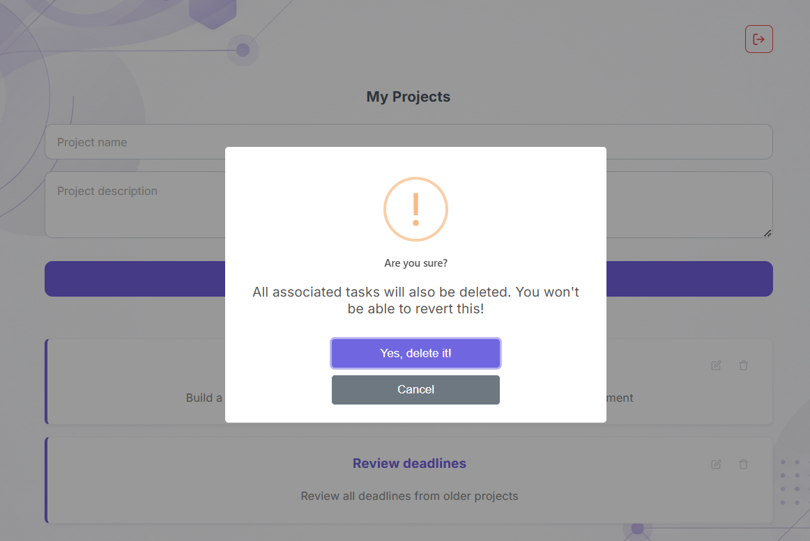
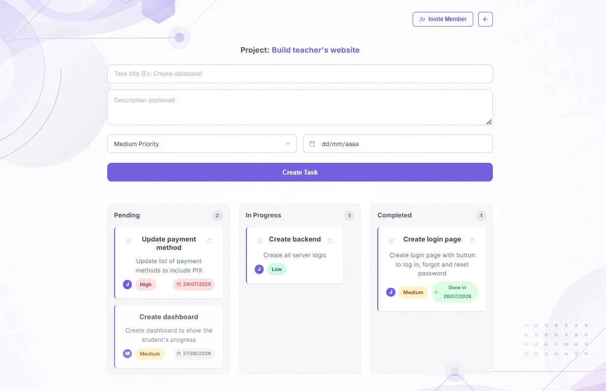
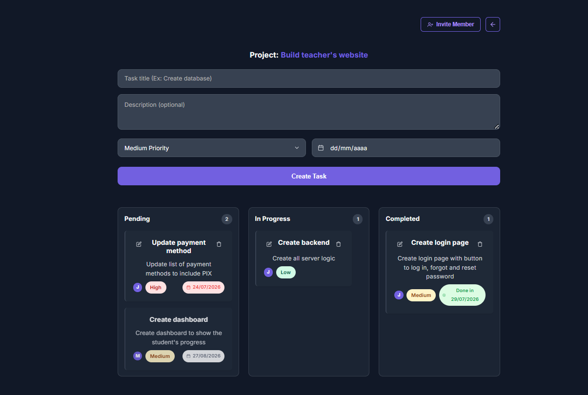
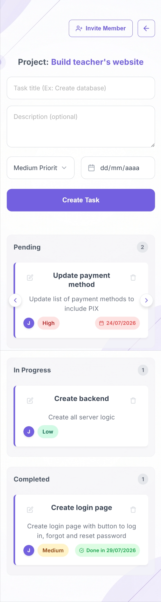

# Modern Task & Project Manager (Kanban Board)

A full-stack project management and task tracking application built with a modern UI, featuring a responsive Kanban board, drag-and-drop support, priority sorting, and mobile-first carousel navigation.

---

## Features

- **Secure Authentication & RBAC:** JWT-based authentication with Role-Based Access Control. Project owners can invite collaborators via email, while permissions dynamically restrict editing and deletion based on user roles and task authorship.
- **Collaborative Workspace & Avatars:** Multi-user support where invited members can collaborate on shared boards. Cards visually display the task author's initial avatar with hover tooltips.
- **Interactive Kanban Board:** Manage tasks across columns (*Pending*, *In Progress*, *Completed*) with smooth drag-and-drop functionality and strict ownership rules (users can only move or edit tasks they created).
- **Global Dark Mode:** Integrated dark/light theme toggle with persistent user preference storage via `localStorage`.
- **Smart Paging & Alerts:** Beautiful, standardized UI notifications and interactive modals powered by SweetAlert2, including automated reminders for overdue and today's tasks.
- **Priority Sorting & Deadlines:** Tasks are automatically organized by priority (*High*, *Medium*, *Low*) and feature dynamic due-date status badges.
- **Mobile-First Responsive Design:** Optimized for mobile devices with a native-like card swipe/carousel experience and snap scrolling.
- **Full CRUD Operations:** Seamlessly create, read, update, and delete projects and tasks with secure, user-scoped backend validation.

---

## Tech Stack

### **Frontend:**
- React & TypeScript
- React Router DOM
- Axios
- SweetAlert2 (Modals, Toasts & Alerts)
- Modern CSS (Flexbox & CSS Grid)

### **Backend:**
- Node.js & Express.js
- MongoDB & Mongoose (Secure user-scoped queries)
- JWT (JSON Web Tokens) for security
- bcrypt for password hashing

---

## Screenshots

---

## License

This project is open-source and available under the MIT License.